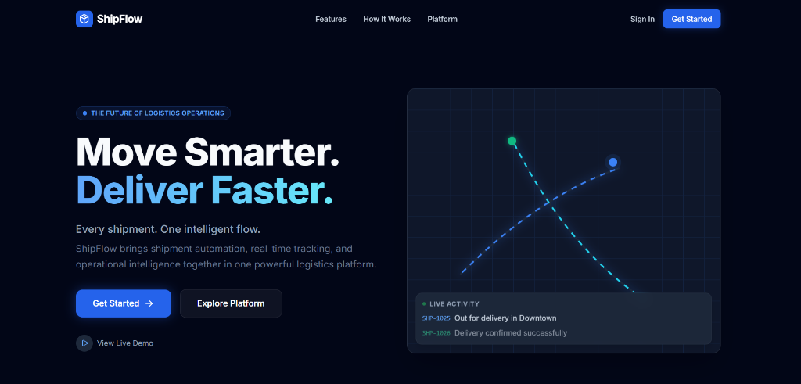

# ShipFlow — Event-Driven Logistics & Delivery Management Platform



**ShipFlow** is a modern, production-grade logistics and delivery management platform. It is designed to reduce manual operational workflows and provide real-time shipment visibility through intelligent automation and an event-driven architecture. 

From shipment creation to final delivery, ShipFlow connects every operational step into a single seamless platform.

## 🚀 Key Features

- **Smart Shipment Automation**: Automate workflows and reduce repetitive tasks from creation to delivery.
- **Real-Time Tracking**: Monitor shipment progress and receive live status updates instantly without refreshing via WebSockets.
- **Intelligent Assignment**: Automatically assign delivery partners based on availability, service zones, workload, and shipment priority.
- **Exception Management**: Identify failed deliveries, delayed shipments, and operational issues with actionable recovery workflows.
- **Event-Driven Architecture**: Process shipment events asynchronously using RabbitMQ for reliable messaging and background workflows.
- **SLA Monitoring**: Keep track of delivery deadlines and surface shipments that require immediate operational attention.

## 🛠️ Technology Stack

**Frontend**
- **Framework**: React 19 + Vite
- **Styling**: Tailwind CSS (with custom CSS keyframe animations & Glassmorphism)
- **State Management**: Redux Toolkit & React Context
- **Routing**: React Router DOM
- **Icons**: Lucide React
- **Real-Time**: Socket.IO Client

**Backend**
- **Runtime**: Node.js + Express
- **Language**: TypeScript
- **Database**: MongoDB (Mongoose)
- **Message Broker**: RabbitMQ (amqplib)
- **Real-Time**: Socket.IO
- **Validation**: Zod
- **Documentation**: Swagger / OpenAPI

## 📦 Architecture Overview

ShipFlow utilizes a **Microservice-ready Event-Driven Architecture**:
1. **API Layer**: Handles incoming HTTP requests and validates data.
2. **Database Layer**: MongoDB stores core entities (Users, Shipments, Exceptions).
3. **Event Bus (RabbitMQ)**: When critical actions occur (e.g., `shipment.created`, `shipment.delivered`), the API publishes events to RabbitMQ.
4. **Consumers (Background Workers)**: Dedicated consumers listen to the queues to perform asynchronous tasks such as Driver Assignment, SLA Monitoring, and Analytics aggregation.
5. **WebSocket Layer**: Live updates are pushed back to the React frontend instantly.

## 🚦 Getting Started

### Prerequisites
- Node.js (v18+)
- MongoDB (Atlas or Local)
- RabbitMQ (Docker)

### 1. Clone & Install
```bash
git clone https://github.com/danish975/ShipFlow.git
cd ShipFlow

# Install backend dependencies
cd backend && npm install

# Install frontend dependencies
cd ../frontend && npm install
```

### 2. Environment Variables
Ensure you configure your `.env` files.
In the `backend/` directory (or root if running concurrently), create a `.env` file:
```env
PORT=5000
MONGODB_URI=mongodb+srv://<user>:<password>@cluster0.mongodb.net/?appName=Cluster0
RABBITMQ_URL=amqp://localhost
JWT_SECRET=your-secret-key
```

### 3. Start Infrastructure (Docker)
If running RabbitMQ locally:
```bash
docker compose up rabbitmq -d
```

### 4. Run the Application
Start both servers in development mode:

**Backend:**
```bash
cd backend
npm run dev
```

**Frontend:**
```bash
cd frontend
npm run dev
```
Visit `http://localhost:5173` to view the platform.

## 📝 License
This project is licensed under the MIT License.
